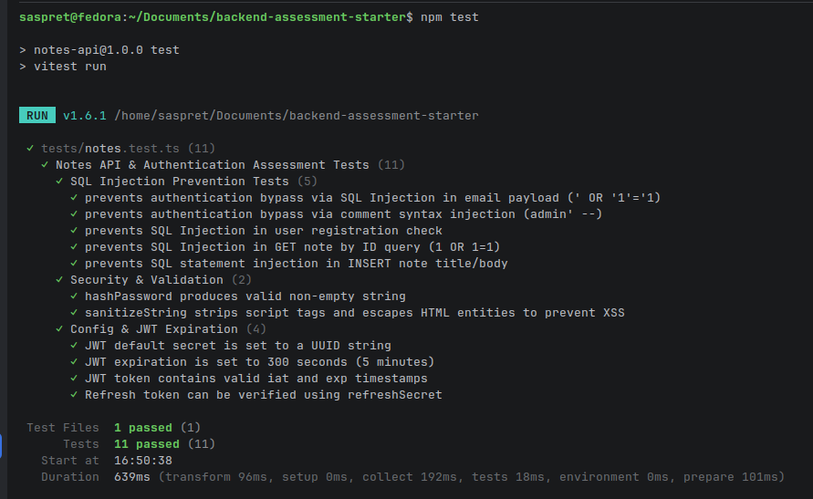

# Code Review

---

## Ringkasan Point-Point yang Perlu Di Fixing

### 1. Security Vulnerabilities - High Priority

| Issue                      | Location                                      | Problem                                                                                                                                                                               | Rekomendasi                                                                                                                                                                 |
|----------------------------|-----------------------------------------------|---------------------------------------------------------------------------------------------------------------------------------------------------------------------------------------|-----------------------------------------------------------------------------------------------------------------------------------------------------------------------------|
| **SQL Injection**          | `src/notes.ts`, `src/users.ts`, `src/auth.ts` | Query WHERE clause masih menggunakan query yang di concatenasi dengan param sehingga memungkinkan penyerang melakukan SQL Injection.                                                  | Gunakan **parameterized queries** menggunakan parameter binding "?" (contoh `db.prepare('SELECT ... WHERE email = ?').get(email)`).                                         |
| **Insecure Authorization** | `endpoint `GET /notes`, `GET /notes/:id`      | Semua endpoint GET/notes seharusnya mengembalikan data notes sesuai hak user yang login saja, tidak boleh mendapatkan semuanya ataupun notes milik user lainnya.                      | Tambahkan filter user_id di setiap query where clause yang didapat valuenya dari token session/JWT.                                                                         |
| **Session JWT**            | `enpoint /login`                              | Tidak ada endpoint refresh token, response expired_at dan iat (issued_at), dan di code'nya sendiri tidak ada config untuk meng-expire token sehingga mekanisme session tidak berjalan | Tambahkan endpoint refresh token, `expiresIn: "1h"` saat `jwt.sign()` dan tambahkan response iat dengan value : time_now dan expired_at dengan value : time_now + expiredIn |
| **Token JWT Secret Key**   | `src/config.ts`                               | Secret key yang di hardcode menggunakan kata yang familiar. Seharunsya yang susah untuk di hafal atau di pahami                                                                       | Generate menggunakan random value misal UUID                                                                                                                                |
| **Log Data Sensitive**     | `src/auth.ts`                                 | `console.log("issued token for", email, token)` mencetak ke log sistem token user.                                                                                                    | Hapus baris console.log yang berkaitan dengan data sensitif                                                                                                                 |

---

### 2. Type Safety and Optimization - Medium Priority

| Issue                | Location       | Problem                                                                                                                                                                            | Rekomendasi                                                                                               |
|----------------------|----------------|------------------------------------------------------------------------------------------------------------------------------------------------------------------------------------|-----------------------------------------------------------------------------------------------------------|
| **N+1 Problem**      | `src/notes.ts` | Terdapat perulangan query `SELECT email FROM users WHERE id=?` dimana semua `id` didapat dari hasil query `SELECT * FROM notes`. hal ini menimbulkan N+1 problem                   | Gunakan clause `join` untuk menggabungkan query                                                           |
| **Input Validation** | `src/auth.ts`, `src/users.ts`, `src/notes.ts` | Belum ada input validation yang handle `check required field, format input (email), XSS attack (sanitazion)`                                                                       | Membuat middleware `input_validator` contoh `zod`.                                                        |
| **`any` Usage**      | `src/auth.ts`, `src/notes.ts`, `src/users.ts`, `src/index.ts` | Ketika menggunakan `any` Typescript tidak ada menge-check tipe data yang digunakan                                                                                                 | Menggunakan DTO (Data Transfer Object) baik untuk request, param function, response dengan keyword 'type' |
| **Error Handling**   | `src/index.ts` | Struktur error handling `{ error: err.message, stack: err.stack }` dimana mengembalikasn response err.stack berupa error sistem dimana user seharusnya tidak perlu tahu error itu. | Hapus `stack` dan usahakan `err.message` adalah error custom yang mudah dipahami.                         |

---

### 3. Clean Code - Low Priority

| Issue                        | File & Location | Masalah                                                                              | Perbaikan yang Direkomendasikan                                                   |
|------------------------------|---|--------------------------------------------------------------------------------------|-----------------------------------------------------------------------------------|
| **Pemisahan Layer**          | `src/notes.ts`, `src/auth.ts`, `src/users.ts` | HTTP routing, bussiness logic, dan query DB masih tercampur di satu file atau layer. | Implementasi layer Index -> Routes -> Controller -> Service -> Repository.        |
| **Single Responsibility DB** | `src/db.ts` | File `db.ts` masih tercampur untuk definisi DB Connection, DB migration, DB Seeds.   | Membuat file/folder baru terpisah untuk masing-masing connection, migration, seeds. |
| **Unit testing**             | `tests/notes.test.ts` | Unit testing masih hanya sebatas untuk dummy saja                                    | Implements masing-masing unit testing di setiap endpoint.                         |

## 3 Hal Utama Sebelum API Masuk Produksi

Jika API ini harus masuk ke lingkungan produksi besok, 3 hal paling utama yang **wajib** diperbaiki terlebih dahulu:

1. **Perbaiki SQL Injection**: Serangan paling mudah untuk dilakukan adalaha SQl Injection, oleh sebab itu issue ini menjadi prioritas utama dengan cara mengganti semua query ke prepared statement dengan parameter binding (`?`).
2. **Fixing Session JWT Token**: Menambahkan expired di token JWT (plus tambah response iat dan exp di endpoint login) agar mekanisme session berjalan dan mengganti secret key.
3. **Tambahkan Input Validation & Amankan Global Error Handler**: Validasi semua payload request dan hapus  `err.stack` dari respon API agar tidak memberikan response error sistem.

## Yang Sudah Fixing 
1. Seluruh SQL Injection dimana semua query `where clause` harus menggunakan `parameterized query ?`.
2. Insecure Authorization dimana semua query `where clause` untuk mendapatkan record notes harus ditambahakan filter user_id dengan value didapat dari JWT token.
3. Fixing session token JWT agar meekanisme session berjalan dengan : 
    - Menambahkan config `expiresIn` di endpoint login
    - Menambahkan response expired_at, iat (issue at), refresh_token di endpoint login 
    - Menambahkan endpoint baru untuk refresh token jika token utama JWT sudah expired
4. Mengubah default JWT secret di config menjadi UUID
5. Menghapus console.log yang meng-ekspose data sensitif
6. Mengatasi N+1 query problem dengan menggunakan clause join untuk menggabungkan 2 query
7. Handle input validation dengan membuat `validator.ts`  dengan tujuan validasi tipe data input, format input (email) dan sanitize input supaya tidak terkena XSS attack
8. Minimalisir penggunaan any diganti dengan penggunaan DTO (Data Transfer Object)  difile `dto.ts`
9. Unit testing : 

## Extra
Penambahkan swagger agar mudah simulasi untuk testing endpoint

## Tech Debt
1. Pemisahan layer Index -> Routes -> Controller -> Service -> Repository.
2. Pemisahan DB Connection, DB Migration, DB Seeds